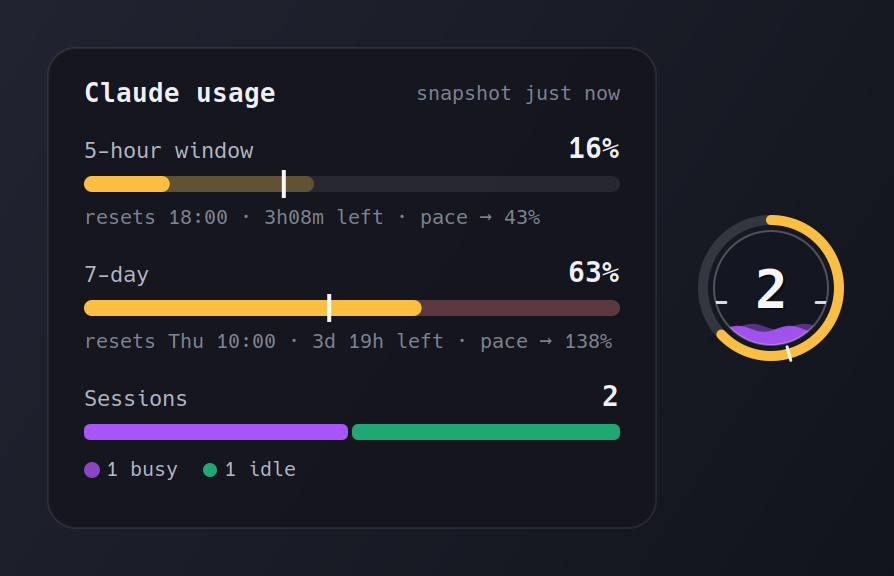
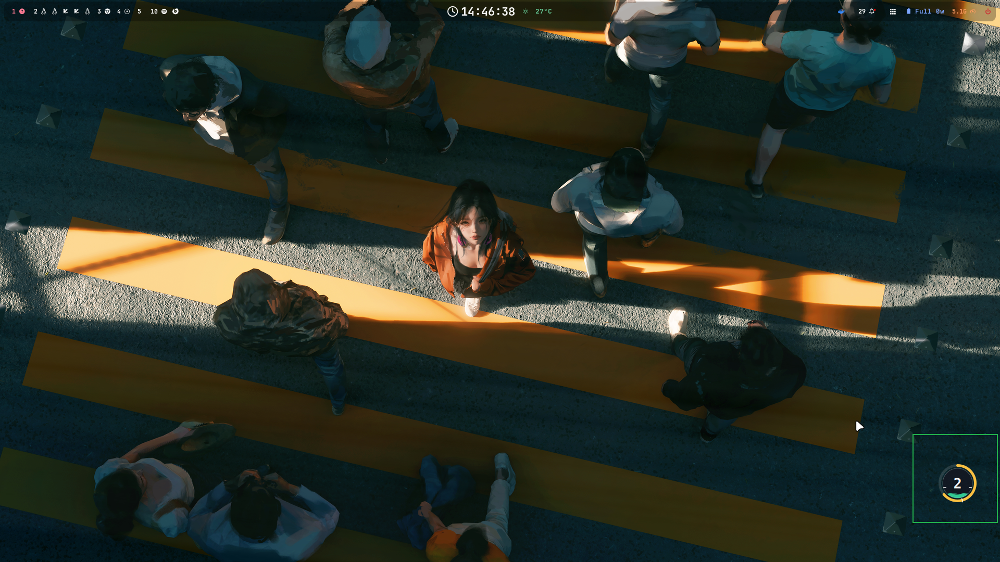
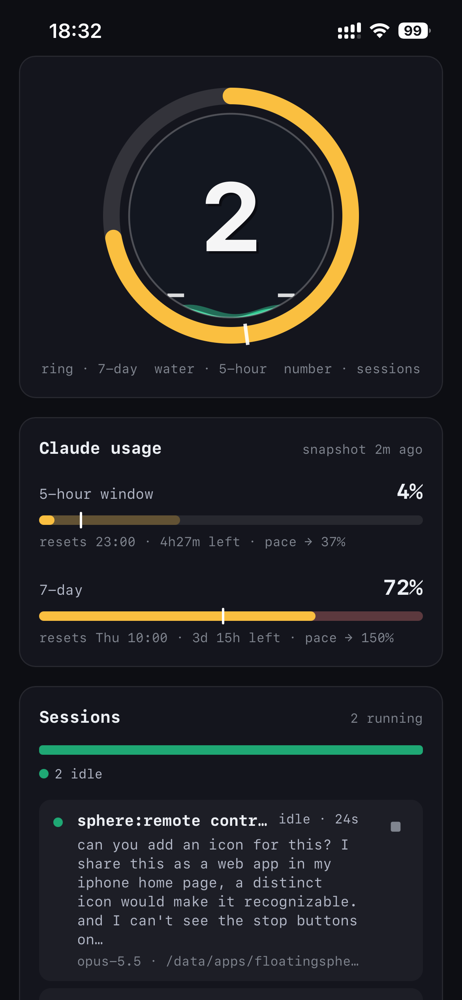

# floatingsphere

A small always-on-top sphere at the right edge of the screen that shows how much of your
Claude subscription you're using, and what your Claude Code sessions are doing.





```
        ╭── 7-day ring: amber arc = used %, white tick = time elapsed in the week,
        │   faint arc = today's quota still left, red = spent past today's quota
      ╭─┴─╮
     │  2  │ ← running Claude Code sessions
     │~~~~~│ ← water: height = current 5-hour window used %
      ╰───╯     red = a session is waiting for your answer,
                purple = any busy, green = all idle
                white rim ticks = time elapsed in the 5-hour window
```

If the water is above the rim ticks (or the amber arc passes the white ring tick), you are
using quota faster than time is passing.

**Today's quota** is claude-maxer's daily budget: what's left of the week (up to its
`weekly_target`, 95%) split evenly over the days until the weekly reset. Today may raise
the 7-day % by one share. It comes from `~/.claude/state/claude-maxer-day.json`, or is
computed the same way (`quota.py`) when maxer hasn't written today's.

## Install

`./install.sh` checks the dependencies and enables the `sphere-web` user service. The
sphere itself is started by Hyprland: the `exec-once`, window rules and kitty remote-control
settings are in [relidaning/dotfiles](https://github.com/relidaning/dotfiles), whose
installer clones this repo to `/data/apps/floatingsphere` and runs `install.sh`.

## Interaction

| Action              | Does                                                                        |
| ------------------- | --------------------------------------------------------------------------- |
| Hover               | Chart card: 5h / 7d meters with a time-elapsed tick (a minibar after the 5h line = today's quota), sessions by status |
| Left-click          | Session list; click a card to jump to its terminal, `+` starts a new session |
| Double right-click  | Quit                                                                        |
| `SUPER` + drag      | Move (it's a normal Hyprland floating window)                               |

The sphere never keeps keyboard focus: clicking it hands focus straight back to the
window you were using.

## Phone notifications

The web view can push a notification to your phone when a session needs your approval or
an answer (with the command or question) or completes a turn (with the start of its reply). Tapping one
opens that session's chat. Sessions whose terminal you're focused on are left alone.

Push needs HTTPS, so `sphere-web` also listens on `https://<pc>:8766`, using
`~/.config/floatingsphere/tls-cert.pem` / `tls-key.pem` (a cert your phone trusts, e.g.
from a mkcert CA installed on it). On an iPhone, open that address in Safari, add it to
the home screen, open it from there and tap the 🔔 next to Sessions.

## Data sources

- **Usage**: `~/.claude/state/usage_snapshot.json` (`rate_limits.five_hour` / `seven_day`
  → `used_percentage`, `resets_at`, plus `cached_at`), refreshed every 15 min by the
  claude-maxer fetch cron. The sphere re-reads it whenever the file changes and dims the
  display when the snapshot is more than 40 min old.
- **Sessions**: Claude Code's own registry, `~/.claude/sessions/<pid>.json` (live status
  `busy` / `waiting` / `idle`), checked against `/proc`. Subagents are hidden; headless
  background runs (cron jobs) are counted.

## Requirements

- Linux + Hyprland (window placement uses `hyprctl`)
- Python 3 with PyGObject, GTK 4, pycairo, PangoCairo
- `rofi` and `kitty` for the popup's `+` new-session button

## Run

```sh
python3 floatingsphere.py &
```

Autostart via Hyprland:

```ini
# Startup_Apps.conf
exec-once = python3 /path/to/floatingsphere/floatingsphere.py
```

The app sets its own window rules at launch, but `hyprctl reload` wipes runtime rules, so
also put these in your Hyprland config to keep the sphere borderless and transparent
after a reload:

```ini
windowrulev2 = float, class:^(dev.floatingsphere)$
windowrulev2 = pin, class:^(dev.floatingsphere)$
windowrulev2 = size 75 75, class:^(dev.floatingsphere)$
windowrulev2 = noborder, class:^(dev.floatingsphere)$
windowrulev2 = noshadow, class:^(dev.floatingsphere)$
windowrulev2 = noblur, class:^(dev.floatingsphere)$
windowrulev2 = noinitialfocus, class:^(dev.floatingsphere)$
windowrulev2 = rounding 0, class:^(dev.floatingsphere)$
windowrulev2 = noanim, class:^(dev.floatingsphere)$
windowrulev2 = nodim, class:^(dev.floatingsphere)$
windowrulev2 = opaque, class:^(dev.floatingsphere)$
windowrulev2 = float, class:^(dev.floatingsphere.popup)$
windowrulev2 = noborder, class:^(dev.floatingsphere.popup)$
windowrulev2 = rounding 14, class:^(dev.floatingsphere.popup)$
windowrulev2 = opaque, class:^(dev.floatingsphere.popup)$
windowrulev2 = nodim, class:^(dev.floatingsphere.popup)$
windowrulev2 = noanim, class:^(dev.floatingsphere.popup)$
windowrulev2 = pin, class:^(dev.floatingsphere.popup)$
```

## Web view (phone / tablet)



The same monitor on a phone, as a home-screen web app (the screenshot is an iPhone):

- **Sphere:** the same drawing as the desktop sphere. Amber ring = 7-day usage with
  the week-elapsed tick and today's quota as a faint arc, water = 5-hour usage with rim ticks for the time elapsed in
  the window, and the number in the middle = running sessions.
- **Claude usage:** the hover card's meters. For the 5-hour window and the week you
  see used %, a white tick for the time elapsed, the reset time and the time left.
  The snapshot's age is at the top right.
- **Sessions:** a bar split by status, then a card per session with its name, status
  and time in that status, current task, running tool, model and folder, plus ■ to
  stop it. The floating **+** at the bottom right starts a new session (see below).
- **Weekly usage:** one bar per week showing how much of the 7-day limit it used,
  split into what each day added, with claude-maxer's weekly target as a dashed line.
  Tap a bar to see that week's dates and each day's share. `sphere_web.py` records it
  (`usage_history.py`, into `~/.config/floatingsphere/usage-weeks.json`), so the
  history builds up as long as the service runs.
- **Chat:** tap a session to open its conversation. You can type prompts into it and
  answer the choices it stops on. Swipe right, or tap ‹, to go back to the list (see below).

`sphere_web.py` serves the same picture as a web page: the sphere, the 5h/7d meters
and the session list, refreshed every 3 s. Each session has the popup's ■ stop button
(tap once to arm, again to stop). The floating **+** opens a sheet to start one: pick a project
under `/data/apps` (recently used first), toggle `--dangerously-skip-permissions` (on
by default) and `--rc` (Remote Control, so the Claude app can drive it), and
optionally give an opening task. It opens a kitty window on the PC running
`claude --name <project> …`, the same as the desktop popup's +. The folder is marked
trusted first, so claude's "do you trust this folder?" dialog doesn't hold it up. It listens on
`0.0.0.0:8765`; set `SPHERE_WEB_HOST` / `SPHERE_WEB_PORT` to change that. Added to an
iPhone home screen it opens full-screen with the sphere icon (`web/make_icons.py`
re-renders the icons).

<br clear="right">

```sh
ln -s "$PWD/sphere-web.service" ~/.config/systemd/user/
systemctl --user enable --now sphere-web
```

### Chat with a session

Tapping a session card slides in its conversation:
- your prompts appear as bubbles, Claude's replies are rendered as markdown, and each
  tool call is a row (tap it to see the result);
- a line at the bottom shows what it's doing now (working · tool · time).

Type in the box and press ↑ to send the prompt. It is typed into the session's kitty
window on the PC, as if you typed it there. While Claude is working, a message you
send is queued for its next turn, and **esc** interrupts it.

When the session stops on a choice, such as a permission prompt ("Do you want to
proceed?") or a question from AskUserQuestion, a sheet pops up with the options:
- tap one to answer;
- multi-select questions show checkboxes and a **Submit** row;
- "Type something" opens a text field;
- **← prev / next →** move between the tabs of a multi-question form.

Hiding the sheet leaves an **answer** button at the bottom. The ⌨ button shows the raw
terminal screen with arrow, tab, digit, esc and enter keys, for anything else, such as
a `/model` menu.

Swipe right anywhere on the chat (or use ‹, or the phone's back gesture) to return
to the list.

This needs kitty remote control. The dotfiles `kitty.conf` enables it on a private
socket (`allow_remote_control socket-only`,
`listen_on unix:${XDG_RUNTIME_DIR}/kitty-{kitty_pid}`). kitty only opens that socket
at startup, so sessions in kitty windows opened before that change can be read but
not typed into. The chat says so. The conversation comes from the session's transcript
(`~/.claude/projects/…/<sessionId>.jsonl`). Dialogs are read off the terminal screen,
because they aren't in the transcript until they're answered.

## Files

| File                   | Role                                                          |
| ---------------------- | ------------------------------------------------------------- |
| `floatingsphere.py`    | The sphere window, drawing, polling, Hyprland placement      |
| `hovercard.py`         | Animated chart card shown on hover                            |
| `sphere_popup.py`      | Clickable session list (left-click)                           |
| `claude_sessions.py`   | Reads Claude Code's session registry and transcripts          |
| `claude_new.sh`        | `+` button: pick a project and a task in rofi, open kitty     |
| `rofi-claude-new.rasi` | rofi theme for `claude_new.sh`                                |
| `sphere_web.py`        | HTTP server for the web view: `/`, `/api/state`, stop, new, chat |
| `usage_history.py`     | Records each week's 7d usage for the web view's weekly chart  |
| `session_chat.py`      | Chat backend: transcript → chat items, kitty typing, dialog parsing |
| `web/index.html`       | The web view (canvas sphere, meters, session list, chat)      |
| `web/make_icons.py`    | Renders the home-screen icons and favicon into `web/`         |
| `sphere-web.service`   | systemd user unit for `sphere_web.py`                         |
